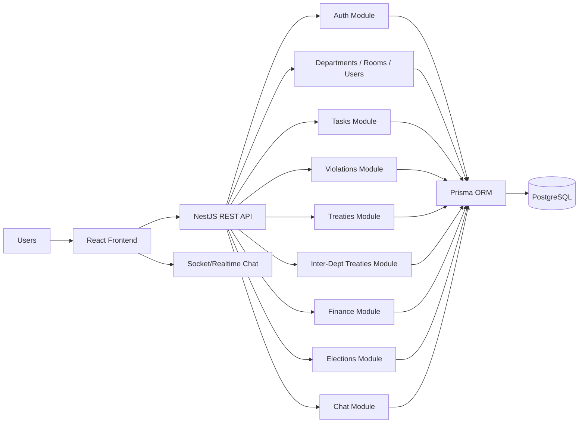
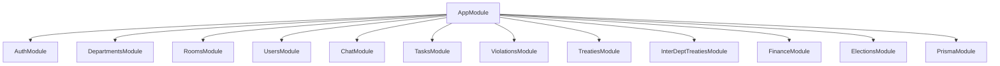
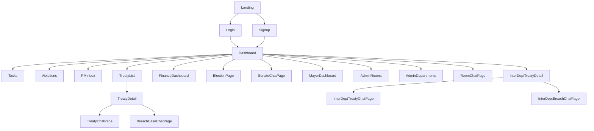
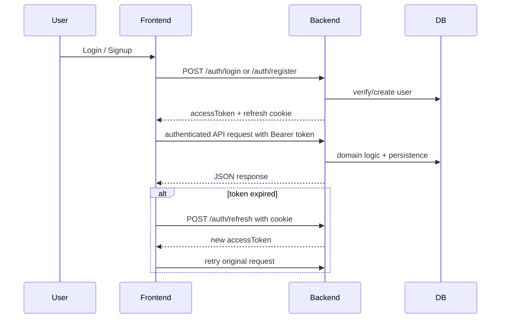
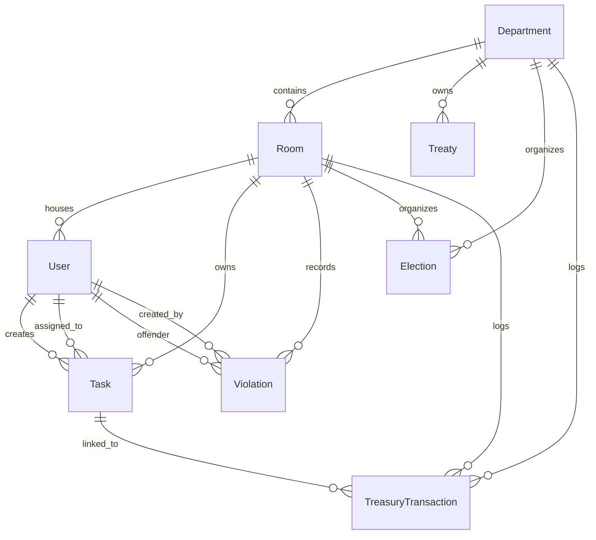
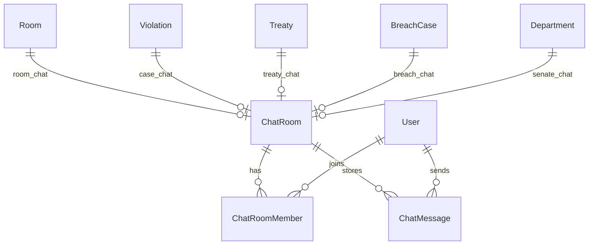
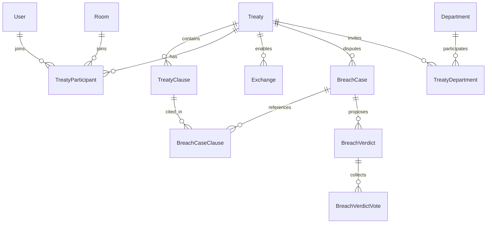
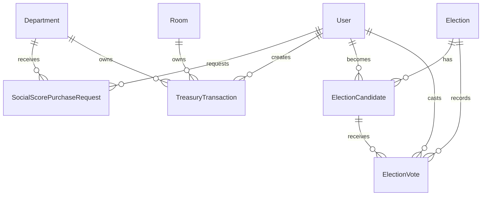
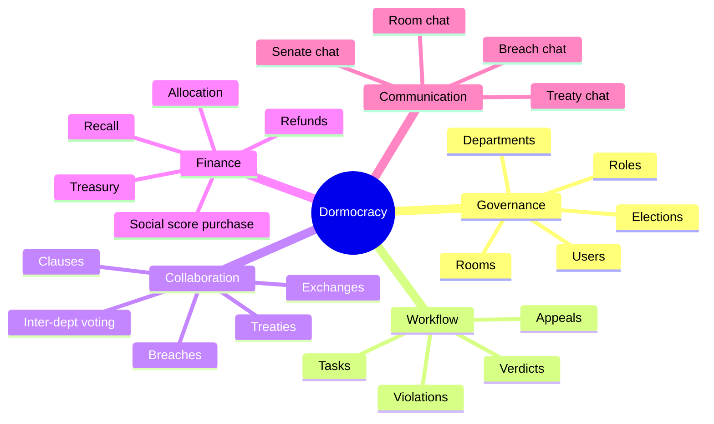

# Dormocracy : Bureau of Halls — Project Report

## Project identity

**Project name:** Dormocracy : Bureau of Halls  
**GitHub repository:** https://github.com/RoyaleBengalTiger/Dormocracy_2.0  
**Repository snapshot observed:** public GitHub repository with 28 commits visible on the main page at the time of review. citeturn380328view0

## Team members

| Name | Student ID |
| --- | --- |
| Khandakar Abu Talib Sifat | 220041246 |
| Md Samiul Islam | 220041207 |
| Muhatadi Bin Maruf | 220041247 |
| Sheikh Mosheul Akbar | 220041137 |

---

## 1. Problem, scope, and project overview

Dormocracy models a residential hall as a miniature digital government. Instead of using a plain hall-management system, the project frames dorm governance as a civic simulation with departments, rooms, mayors, prime ministers, elections, treasury, treaties, violations, and discussion channels.

The system solves several operational and academic problems at once:

1. **Governance digitization:** converts informal room and hall management into trackable workflows.
2. **Role-based administration:** supports citizens, mayors, admins, and department-level leadership.
3. **Accountability:** every meaningful action leaves data traces through violations, treasury transactions, treaties, or elections.
4. **Engagement:** the platform turns governance into a game-like bureaucracy where social score, credits, elections, and inter-room/inter-department treaties create incentives.
5. **Full-stack learning objective:** the codebase demonstrates a non-trivial TypeScript system with frontend, backend, authentication, real-time chat, and relational data modeling.

The uploaded project contains:
- a **NestJS backend** organized into domain modules,
- a **React + TypeScript frontend** with protected routes and modular API clients,
- a **Prisma/PostgreSQL schema** containing a rich relational design,
- limited frontend test scaffolding,
- strong use of workflow-centric backend services.

### Scope summary

The current implementation goes far beyond basic CRUD. It includes:
- authentication and role-based authorization,
- department and room administration,
- room task lifecycle management,
- room chat and case-specific chats,
- violations, appeals, and evaluation workflows,
- treaty creation and negotiation,
- inter-department treaty voting and breach verdicts,
- finance and treasury transactions,
- election management for room and department governance.

### High-level architecture



### Backend module map



---

## 2. List of features with brief descriptions

| Feature | Description |
| --- | --- |
| User registration and login | Users register into a department and room, and log in using JWT-based authentication with refresh-token cookie support. |
| Role-based access control | The system distinguishes `CITIZEN`, `MAYOR`, and `ADMIN`, and enforces guarded routes in the backend. |
| Department administration | Admins can create, update, delete departments and assign department leadership such as Prime Minister, Foreign Minister, and Finance Minister. |
| Room administration | Admins can create rooms, modify room information, and assign mayors to rooms. |
| User profile management | Authenticated users can fetch and update their own profile; admins can manage other users. |
| Room chat | Citizens in the same room can communicate through a shared room chat with paginated message loading. |
| Task lifecycle | Citizens can create tasks; mayors approve and assign tasks; assignees complete tasks; mayors review and close them. |
| Task funding | Tasks can spend from room treasury and reward assignees when accepted. |
| Violation management | Mayors/admins can create violations against users, with support for points, fines, expiry, and appeal flows. |
| Violation appeals and evaluation | Prime Ministers can start evaluation, open case-specific chats, add case members, and close appeals with verdicts. |
| Punish-mayor workflow | If a violation case is overturned in a special way, the system can create a penalty against the mayor who issued it. |
| Treaty management | Departments can create treaties, add participants, add clauses, negotiate terms, and manage lifecycle states. |
| Exchange-based treaties | Treaties can include exchanges with bounty-based interactions between seller and buyer roles. |
| Breach case handling | Treaty participants can file breach cases, link clauses, start evaluation, choose penalties, and resolve disputes. |
| Inter-department treaties | A larger treaty model supports invited departments, stakeholder discovery, locked clauses, voting, and senate-like coordination. |
| Breach verdict voting | Inter-department breaches support proposed verdicts and department-level voting before finalization. |
| Treasury and finance | Departments and rooms have treasury balances; fund allocation/recall operations are logged as transactions. |
| Social score purchase | Users can request to buy social score from departments, accept offers, and update jail status accordingly. |
| Elections | The system supports room-level and department-level elections, candidate registration, voting, tie handling, and minister assignment. |
| Senate chat | Departments have senate chat functionality integrated with the election subsystem. |
| Protected frontend routing | Frontend pages are protected by authentication and, for some pages, by role checks. |
| Token refresh logic | The frontend automatically attempts token refresh on 401 responses. |

### Frontend page map



---

## 3. Tools and technologies used

| Layer | Tools / Technologies |
| --- | --- |
| Frontend | React, TypeScript, React Router, TanStack Query, Vite-style project structure |
| Backend | NestJS, TypeScript, Fastify adapter |
| ORM / DB access | Prisma |
| Database | PostgreSQL (declared in Prisma datasource) |
| Authentication | JWT access token + refresh token, Argon2 password hashing |
| Authorization | NestJS guards, role decorators, JWT guard, roles guard |
| Realtime / communication | Socket.IO client usage in frontend, REST chat fallback endpoints in backend |
| Validation | NestJS `ValidationPipe`, DTO validation pattern |
| Testing | Vitest frontend scaffolding, Testing Library setup |
| API style | Modular REST API with role-aware endpoints |
| Diagramming in this report | Mermaid |

### Request / authentication flow



---

## 4. Database design

The Prisma schema is the strongest part of the project from a software-engineering perspective. It models governance, workflow, treasury, chat, treaties, and elections in a unified relational structure.

### Database design principles visible in the schema

1. **Strong normalization:** entities such as users, rooms, departments, tasks, treaties, and elections are separated cleanly.
2. **Explicit workflow states:** many models rely on enums to encode business process state.
3. **Auditability:** treasury transactions, createdBy fields, timestamps, and status histories improve traceability.
4. **Context-specific chats:** chat rooms are polymorphic by type and can belong to rooms, violations, treaties, breach cases, or senate groups.
5. **Atomic business operations:** the backend frequently uses transactions for financial and rule-sensitive updates.
6. **Rich relational integrity:** foreign keys, unique constraints, and indices appear throughout the schema.

### Core ERD



### Communication / case ERD



### Treaty / breach ERD



### Finance / election ERD



### Important tables and roles

- **User**: central actor table; stores room membership, role, social score, credits, jail state, auth refresh hash, and links to most workflows.
- **Department**: higher governance unit with treasury and minister assignments.
- **Room**: lower governance unit under a department with treasury and mayor.
- **Task**: structured room-level work pipeline.
- **Violation**: discipline and appeal mechanism.
- **ChatRoom / ChatMessage / ChatRoomMember**: communication layer.
- **TreasuryTransaction**: financial ledger.
- **Treaty / TreatyClause / TreatyParticipant / Exchange / BreachCase**: inter-room or inter-user collaboration and dispute handling.
- **TreatyDepartment / BreachVerdict / BreachVerdictVote**: inter-department consensus model.
- **Election / ElectionCandidate / ElectionVote**: democratic governance subsystem.

### Full schema design by table

### `User`

| Field | Type | Key / Role | Attributes |
| --- | --- | --- | --- |
| id | String | PK, DEFAULT | @id @default(uuid()) |
| username | String | UNIQUE | @unique |
| email | String | UNIQUE | @unique |
| password | String | - | - |
| role | Role | DEFAULT | @default(CITIZEN) |
| refreshTokenHash | String? | - | - |
| socialScore | Int | DEFAULT | @default(50) |
| credits | Int | DEFAULT | @default(100) |
| isJailed | Boolean | DEFAULT | @default(false) |
| roomId | String | - | - |
| room | Room | REL | @relation(fields: [roomId], references: [id], onDelete: Restrict) |
| createdAt | DateTime | DEFAULT | @default(now()) |
| updatedAt | DateTime | UPDATED_AT | @updatedAt |
| createdTasks | Task[] | REL | @relation("TaskCreatedBy") |
| assignedTasks | Task[] | REL | @relation("TaskAssignedTo") |
| mayorOfRooms | Room[] | REL | @relation("RoomMayor") |
| primeMinisterOfDepartments | Department[] | REL | @relation("DepartmentPrimeMinister") |
| foreignMinisterOfDepartments | Department[] | REL | @relation("DepartmentForeignMinister") |
| financeMinisterOfDepartments | Department[] | REL | @relation("DepartmentFinanceMinister") |
| violationsReceived | Violation[] | REL | @relation("ViolationOffender") |
| violationsIssued | Violation[] | REL | @relation("ViolationCreatedBy") |
| chatMemberships | ChatRoomMember[] | - | - |
| sentMessages | ChatMessage[] | - | - |
| treasuryTransactionsCreated | TreasuryTransaction[] | REL | @relation("TreasuryTransactionCreatedBy") |
| socialScorePurchaseRequests | SocialScorePurchaseRequest[] | REL | @relation("SocialScoreRequestUser") |
| socialScorePurchaseOffers | SocialScorePurchaseRequest[] | REL | @relation("SocialScoreRequestOfferedBy") |
| createdTreaties | Treaty[] | REL | @relation("TreatyCreatedBy") |
| hostFmTreaties | Treaty[] | REL | @relation("TreatyHostFM") |
| treatyParticipations | TreatyParticipant[] | REL | @relation("TreatyParticipantUser") |
| createdClauses | TreatyClause[] | REL | @relation("ClauseCreatedBy") |
| lockedClauses | TreatyClause[] | REL | @relation("ClauseLockedBy") |
| exchangesSelling | Exchange[] | REL | @relation("ExchangeSeller") |
| exchangesBuying | Exchange[] | REL | @relation("ExchangeBuyer") |
| breachCasesFiled | BreachCase[] | REL | @relation("BreachCaseFiler") |
| breachCasesAccused | BreachCase[] | REL | @relation("BreachCaseAccused") |
| breachCasesResolved | BreachCase[] | REL | @relation("BreachCaseResolver") |
| breachCasesRuledBy | BreachCase[] | REL | @relation("BreachCaseRuledBy") |
| breachCasesRulingTarget | BreachCase[] | REL | @relation("BreachCaseRulingTarget") |
| treatyDeptInvites | TreatyDepartment[] | REL | @relation("TreatyDeptInvitedBy") |
| treatyDeptResponses | TreatyDepartment[] | REL | @relation("TreatyDeptRespondedBy") |
| breachVerdictsProposed | BreachVerdict[] | REL | @relation("BreachVerdictProposedBy") |
| breachVerdictVotes | BreachVerdictVote[] | REL | @relation("BreachVerdictVoter") |
| electionsWon | Election[] | REL | @relation("ElectionWinner") |
| electionCandidacies | ElectionCandidate[] | REL | @relation("ElectionCandidateUser") |
| electionVotes | ElectionVote[] | REL | @relation("ElectionVoter") |

### `Department`

| Field | Type | Key / Role | Attributes |
| --- | --- | --- | --- |
| id | String | PK, DEFAULT | @id @default(uuid()) |
| name | String | UNIQUE | @unique |
| treasuryCredits | Int | DEFAULT | @default(1000) |
| rooms | Room[] | - | - |
| treaties | Treaty[] | - | - |
| elections | Election[] | REL | @relation("ElectionDepartment") |
| primeMinisterId | String? | - | - |
| primeMinister | User? | REL | @relation("DepartmentPrimeMinister", fields: [primeMinisterId], references: [id], onDelete: SetNull) |
| foreignMinisterId | String? | - | - |
| foreignMinister | User? | REL | @relation("DepartmentForeignMinister", fields: [foreignMinisterId], references: [id], onDelete: SetNull) |
| financeMinisterId | String? | - | - |
| financeMinister | User? | REL | @relation("DepartmentFinanceMinister", fields: [financeMinisterId], references: [id], onDelete: SetNull) |
| treasuryTransactions | TreasuryTransaction[] | - | - |
| socialScorePurchaseRequests | SocialScorePurchaseRequest[] | - | - |
| treatyDepartments | TreatyDepartment[] | - | - |
| breachVerdictVotes | BreachVerdictVote[] | REL | @relation("BreachVerdictVoterDept") |
| senateChatRoom | ChatRoom? | REL | @relation("DepartmentSenateChatRoom") |
| createdAt | DateTime | DEFAULT | @default(now()) |
| updatedAt | DateTime | UPDATED_AT | @updatedAt |

### `Room`

| Field | Type | Key / Role | Attributes |
| --- | --- | --- | --- |
| id | String | PK, DEFAULT | @id @default(uuid()) |
| roomNumber | String | - | - |
| departmentId | String | - | - |
| treasuryCredits | Int | DEFAULT | @default(0) |
| department | Department | REL | @relation(fields: [departmentId], references: [id], onDelete: Restrict) |
| users | User[] | - | - |
| mayorId | String? | - | - |
| mayor | User? | REL | @relation("RoomMayor", fields: [mayorId], references: [id], onDelete: SetNull) |
| createdAt | DateTime | DEFAULT | @default(now()) |
| updatedAt | DateTime | UPDATED_AT | @updatedAt |
| tasks | Task[] | - | - |
| violations | Violation[] | - | - |
| chatRoom | ChatRoom? | - | - |
| treatyParticipations | TreatyParticipant[] | REL | @relation("TreatyParticipantRoom") |
| treasuryTransactions | TreasuryTransaction[] | - | - |
| elections | Election[] | REL | @relation("ElectionRoom") |

### `Task`

| Field | Type | Key / Role | Attributes |
| --- | --- | --- | --- |
| id | String | PK, DEFAULT | @id @default(uuid()) |
| title | String | - | - |
| description | String? | - | - |
| status | TaskStatus | DEFAULT | @default(PENDING_APPROVAL) |
| fundAmount | Int | DEFAULT | @default(0) |
| roomId | String | - | - |
| room | Room | REL | @relation(fields: [roomId], references: [id], onDelete: Restrict) |
| createdById | String | - | - |
| createdBy | User | REL | @relation("TaskCreatedBy", fields: [createdById], references: [id], onDelete: Restrict) |
| assignedToId | String? | - | - |
| assignedTo | User? | REL | @relation("TaskAssignedTo", fields: [assignedToId], references: [id], onDelete: SetNull) |
| completionSummary | String? | - | - |
| completedAt | DateTime? | - | - |
| mayorReviewNote | String? | - | - |
| reviewedAt | DateTime? | - | - |
| createdAt | DateTime | DEFAULT | @default(now()) |
| updatedAt | DateTime | UPDATED_AT | @updatedAt |
| treasuryTransactions | TreasuryTransaction[] | - | - |

### `ChatRoom`

| Field | Type | Key / Role | Attributes |
| --- | --- | --- | --- |
| id | String | PK, DEFAULT | @id @default(uuid()) |
| type | ChatRoomType | DEFAULT | @default(ROOM) |
| roomId | String? | UNIQUE | @unique |
| room | Room? | REL | @relation(fields: [roomId], references: [id], onDelete: Cascade) |
| violationId | String? | UNIQUE | @unique |
| violation | Violation? | REL | @relation(fields: [violationId], references: [id], onDelete: Cascade) |
| treatyId | String? | UNIQUE | @unique |
| treaty | Treaty? | REL | @relation(fields: [treatyId], references: [id], onDelete: Cascade) |
| breachCaseId | String? | UNIQUE | @unique |
| breachCase | BreachCase? | REL | @relation(fields: [breachCaseId], references: [id], onDelete: Cascade) |
| departmentSenateId | String? | UNIQUE | @unique |
| departmentSenate | Department? | REL | @relation("DepartmentSenateChatRoom", fields: [departmentSenateId], references: [id], onDelete: Cascade) |
| closedAt | DateTime? | - | - |
| members | ChatRoomMember[] | - | - |
| messages | ChatMessage[] | - | - |
| createdAt | DateTime | DEFAULT | @default(now()) |
| updatedAt | DateTime | UPDATED_AT | @updatedAt |

### `ChatRoomMember`

| Field | Type | Key / Role | Attributes |
| --- | --- | --- | --- |
| id | String | PK, DEFAULT | @id @default(uuid()) |
| chatRoomId | String | - | - |
| userId | String | - | - |
| chatRoom | ChatRoom | REL | @relation(fields: [chatRoomId], references: [id], onDelete: Cascade) |
| user | User | REL | @relation(fields: [userId], references: [id], onDelete: Cascade) |
| mutedUntil | DateTime? | - | - |
| joinedAt | DateTime | DEFAULT | @default(now()) |

### `ChatMessage`

| Field | Type | Key / Role | Attributes |
| --- | --- | --- | --- |
| id | String | PK, DEFAULT | @id @default(uuid()) |
| chatRoomId | String | - | - |
| senderId | String | - | - |
| chatRoom | ChatRoom | REL | @relation(fields: [chatRoomId], references: [id], onDelete: Cascade) |
| sender | User | REL | @relation(fields: [senderId], references: [id], onDelete: Restrict) |
| content | String | - | - |
| deletedAt | DateTime? | - | - |
| createdAt | DateTime | DEFAULT | @default(now()) |

### `Violation`

| Field | Type | Key / Role | Attributes |
| --- | --- | --- | --- |
| id | String | PK, DEFAULT | @id @default(uuid()) |
| status | ViolationStatus | DEFAULT | @default(ACTIVE) |
| roomId | String | - | - |
| room | Room | REL | @relation(fields: [roomId], references: [id], onDelete: Restrict) |
| offenderId | String | - | - |
| offender | User | REL | @relation("ViolationOffender", fields: [offenderId], references: [id], onDelete: Restrict) |
| createdById | String | - | - |
| createdBy | User | REL | @relation("ViolationCreatedBy", fields: [createdById], references: [id], onDelete: Restrict) |
| title | String | - | - |
| description | String? | - | - |
| points | Int | - | - |
| creditFine | Int | DEFAULT | @default(0) |
| penaltyMode | ViolationPenaltyMode | DEFAULT | @default(BOTH_MANDATORY) |
| offenderChoice | ViolationOffenderChoice? | - | - |
| creditsDeducted | Int | DEFAULT | @default(0) |
| pointsDeducted | Int | DEFAULT | @default(0) |
| creditsRefunded | Int | DEFAULT | @default(0) |
| expiresAt | DateTime? | - | - |
| archivedAt | DateTime? | - | - |
| pointsRefunded | Int | DEFAULT | @default(0) |
| refundedAt | DateTime? | - | - |
| appealedAt | DateTime? | - | - |
| appealNote | String? | - | - |
| evaluationStartedAt | DateTime? | - | - |
| evaluationClosedAt | DateTime? | - | - |
| chatRoom | ChatRoom? | - | - |
| verdict | ViolationVerdict? | - | - |
| verdictNote | String? | - | - |
| closedById | String? | - | - |
| mayorViolationId | String? | - | - |
| treasuryTransactions | TreasuryTransaction[] | - | - |
| createdAt | DateTime | DEFAULT | @default(now()) |
| updatedAt | DateTime | UPDATED_AT | @updatedAt |

### `TreasuryTransaction`

| Field | Type | Key / Role | Attributes |
| --- | --- | --- | --- |
| id | String | PK, DEFAULT | @id @default(uuid()) |
| type | TreasuryTransactionType | - | - |
| amount | Int | - | - |
| departmentId | String? | - | - |
| department | Department? | REL | @relation(fields: [departmentId], references: [id], onDelete: SetNull) |
| roomId | String? | - | - |
| room | Room? | REL | @relation(fields: [roomId], references: [id], onDelete: SetNull) |
| taskId | String? | - | - |
| task | Task? | REL | @relation(fields: [taskId], references: [id], onDelete: SetNull) |
| breachCaseId | String? | - | - |
| breachCase | BreachCase? | REL | @relation(fields: [breachCaseId], references: [id], onDelete: SetNull) |
| violationId | String? | - | - |
| violation | Violation? | REL | @relation(fields: [violationId], references: [id], onDelete: SetNull) |
| userId | String? | - | - |
| createdById | String | - | - |
| createdBy | User | REL | @relation("TreasuryTransactionCreatedBy", fields: [createdById], references: [id], onDelete: Restrict) |
| note | String? | - | - |
| createdAt | DateTime | DEFAULT | @default(now()) |

### `SocialScorePurchaseRequest`

| Field | Type | Key / Role | Attributes |
| --- | --- | --- | --- |
| id | String | PK, DEFAULT | @id @default(uuid()) |
| userId | String | - | - |
| user | User | REL | @relation("SocialScoreRequestUser", fields: [userId], references: [id], onDelete: Restrict) |
| departmentId | String | - | - |
| department | Department | REL | @relation(fields: [departmentId], references: [id], onDelete: Restrict) |
| status | SocialScorePurchaseStatus | DEFAULT | @default(REQUESTED) |
| requestNote | String? | - | - |
| offeredById | String? | - | - |
| offeredBy | User? | REL | @relation("SocialScoreRequestOfferedBy", fields: [offeredById], references: [id], onDelete: SetNull) |
| offeredPriceCredits | Int? | - | - |
| offeredSocialScore | Int? | - | - |
| offeredAt | DateTime? | - | - |
| respondedAt | DateTime? | - | - |
| createdAt | DateTime | DEFAULT | @default(now()) |
| updatedAt | DateTime | UPDATED_AT | @updatedAt |

### `Treaty`

| Field | Type | Key / Role | Attributes |
| --- | --- | --- | --- |
| id | String | PK, DEFAULT | @id @default(uuid()) |
| title | String | - | - |
| type | TreatyType | DEFAULT | @default(NON_EXCHANGE) |
| status | TreatyStatus | DEFAULT | @default(NEGOTIATION) |
| mode | TreatyMode | DEFAULT | @default(DEPT_SCOPE) |
| departmentId | String | - | - |
| department | Department | REL | @relation(fields: [departmentId], references: [id], onDelete: Restrict) |
| createdById | String | - | - |
| createdBy | User | REL | @relation("TreatyCreatedBy", fields: [createdById], references: [id], onDelete: Restrict) |
| hostForeignMinisterId | String? | - | - |
| hostForeignMinister | User? | REL | @relation("TreatyHostFM", fields: [hostForeignMinisterId], references: [id], onDelete: SetNull) |
| endsAt | DateTime | - | - |
| chatRoom | ChatRoom? | - | - |
| participants | TreatyParticipant[] | - | - |
| clauses | TreatyClause[] | - | - |
| exchanges | Exchange[] | - | - |
| breachCases | BreachCase[] | - | - |
| treatyDepartments | TreatyDepartment[] | - | - |
| breachVerdicts | BreachVerdict[] | - | - |
| createdAt | DateTime | DEFAULT | @default(now()) |
| updatedAt | DateTime | UPDATED_AT | @updatedAt |

### `TreatyClause`

| Field | Type | Key / Role | Attributes |
| --- | --- | --- | --- |
| id | String | PK, DEFAULT | @id @default(uuid()) |
| treatyId | String | - | - |
| treaty | Treaty | REL | @relation(fields: [treatyId], references: [id], onDelete: Cascade) |
| content | String | - | - |
| orderIndex | Int | DEFAULT | @default(0) |
| createdById | String | - | - |
| createdBy | User | REL | @relation("ClauseCreatedBy", fields: [createdById], references: [id], onDelete: Restrict) |
| isLocked | Boolean | DEFAULT | @default(false) |
| lockedById | String? | - | - |
| lockedBy | User? | REL | @relation("ClauseLockedBy", fields: [lockedById], references: [id], onDelete: SetNull) |
| lockedAt | DateTime? | - | - |
| breachCases | BreachCaseClause[] | - | - |
| createdAt | DateTime | DEFAULT | @default(now()) |
| updatedAt | DateTime | UPDATED_AT | @updatedAt |

### `TreatyParticipant`

| Field | Type | Key / Role | Attributes |
| --- | --- | --- | --- |
| id | String | PK, DEFAULT | @id @default(uuid()) |
| treatyId | String | - | - |
| treaty | Treaty | REL | @relation(fields: [treatyId], references: [id], onDelete: Cascade) |
| type | ParticipantType | - | - |
| status | ParticipantStatus | DEFAULT | @default(PENDING) |
| roomId | String? | - | - |
| room | Room? | REL | @relation("TreatyParticipantRoom", fields: [roomId], references: [id], onDelete: Cascade) |
| userId | String? | - | - |
| user | User? | REL | @relation("TreatyParticipantUser", fields: [userId], references: [id], onDelete: Cascade) |
| respondedAt | DateTime? | - | - |
| createdAt | DateTime | DEFAULT | @default(now()) |

### `Exchange`

| Field | Type | Key / Role | Attributes |
| --- | --- | --- | --- |
| id | String | PK, DEFAULT | @id @default(uuid()) |
| treatyId | String | - | - |
| treaty | Treaty | REL | @relation(fields: [treatyId], references: [id], onDelete: Cascade) |
| type | ExchangeType | - | - |
| status | ExchangeStatus | DEFAULT | @default(OPEN) |
| title | String | - | - |
| description | String? | - | - |
| bounty | Int | - | - |
| sellerId | String? | - | - |
| seller | User? | REL | @relation("ExchangeSeller", fields: [sellerId], references: [id], onDelete: SetNull) |
| buyerId | String | - | - |
| buyer | User | REL | @relation("ExchangeBuyer", fields: [buyerId], references: [id], onDelete: Restrict) |
| deliveryNotes | String? | - | - |
| deliveredAt | DateTime? | - | - |
| reviewedAt | DateTime? | - | - |
| createdAt | DateTime | DEFAULT | @default(now()) |
| updatedAt | DateTime | UPDATED_AT | @updatedAt |

### `BreachCase`

| Field | Type | Key / Role | Attributes |
| --- | --- | --- | --- |
| id | String | PK, DEFAULT | @id @default(uuid()) |
| treatyId | String | - | - |
| treaty | Treaty | REL | @relation(fields: [treatyId], references: [id], onDelete: Cascade) |
| status | BreachCaseStatus | DEFAULT | @default(OPEN) |
| filerId | String | - | - |
| filer | User | REL | @relation("BreachCaseFiler", fields: [filerId], references: [id], onDelete: Restrict) |
| accusedUserId | String | - | - |
| accusedUser | User | REL | @relation("BreachCaseAccused", fields: [accusedUserId], references: [id], onDelete: Restrict) |
| title | String | - | - |
| description | String? | - | - |
| exchangeId | String? | - | - |
| clauses | BreachCaseClause[] | - | - |
| chatRoom | ChatRoom? | - | - |
| evaluatedAt | DateTime? | - | - |
| ruledAt | DateTime? | - | - |
| ruledById | String? | - | - |
| ruledBy | User? | REL | @relation("BreachCaseRuledBy", fields: [ruledById], references: [id], onDelete: SetNull) |
| rulingType | BreachRulingType? | - | - |
| rulingTargetUserId | String? | - | - |
| rulingTarget | User? | REL | @relation("BreachCaseRulingTarget", fields: [rulingTargetUserId], references: [id], onDelete: SetNull) |
| penaltyMode | BreachPenaltyMode? | - | - |
| socialPenalty | Int? | - | - |
| creditFine | Int? | - | - |
| criminalChoice | BreachCriminalChoice? | - | - |
| resolutionNote | String? | - | - |
| resolvedById | String? | - | - |
| resolvedBy | User? | REL | @relation("BreachCaseResolver", fields: [resolvedById], references: [id], onDelete: SetNull) |
| resolvedAt | DateTime? | - | - |
| treasuryTransactions | TreasuryTransaction[] | - | - |
| createdAt | DateTime | DEFAULT | @default(now()) |
| updatedAt | DateTime | UPDATED_AT | @updatedAt |
| breachVerdicts | BreachVerdict[] | - | - |

### `BreachCaseClause`

| Field | Type | Key / Role | Attributes |
| --- | --- | --- | --- |
| id | String | PK, DEFAULT | @id @default(uuid()) |
| breachCaseId | String | - | - |
| breachCase | BreachCase | REL | @relation(fields: [breachCaseId], references: [id], onDelete: Cascade) |
| clauseId | String | - | - |
| clause | TreatyClause | REL | @relation(fields: [clauseId], references: [id], onDelete: Cascade) |

### `TreatyDepartment`

| Field | Type | Key / Role | Attributes |
| --- | --- | --- | --- |
| id | String | PK, DEFAULT | @id @default(uuid()) |
| treatyId | String | - | - |
| treaty | Treaty | REL | @relation(fields: [treatyId], references: [id], onDelete: Cascade) |
| departmentId | String | - | - |
| department | Department | REL | @relation(fields: [departmentId], references: [id], onDelete: Restrict) |
| status | TreatyDepartmentStatus | DEFAULT | @default(PENDING) |
| invitedById | String | - | - |
| invitedBy | User | REL | @relation("TreatyDeptInvitedBy", fields: [invitedById], references: [id], onDelete: Restrict) |
| respondedById | String? | - | - |
| respondedBy | User? | REL | @relation("TreatyDeptRespondedBy", fields: [respondedById], references: [id], onDelete: SetNull) |
| respondedAt | DateTime? | - | - |
| createdAt | DateTime | DEFAULT | @default(now()) |
| updatedAt | DateTime | UPDATED_AT | @updatedAt |

### `BreachVerdict`

| Field | Type | Key / Role | Attributes |
| --- | --- | --- | --- |
| id | String | PK, DEFAULT | @id @default(uuid()) |
| breachCaseId | String | - | - |
| breachCase | BreachCase | REL | @relation(fields: [breachCaseId], references: [id], onDelete: Cascade) |
| treatyId | String | - | - |
| treaty | Treaty | REL | @relation(fields: [treatyId], references: [id], onDelete: Cascade) |
| proposedById | String | - | - |
| proposedBy | User | REL | @relation("BreachVerdictProposedBy", fields: [proposedById], references: [id], onDelete: Restrict) |
| status | BreachVerdictStatus | DEFAULT | @default(PROPOSED) |
| ruledAgainst | BreachVerdictRuling | DEFAULT | @default(NONE) |
| creditFine | Int | DEFAULT | @default(0) |
| socialPenalty | Int | DEFAULT | @default(0) |
| penaltyMode | BreachVerdictPenaltyMode | DEFAULT | @default(BOTH_MANDATORY) |
| notes | String? | - | - |
| votes | BreachVerdictVote[] | - | - |
| createdAt | DateTime | DEFAULT | @default(now()) |
| finalizedAt | DateTime? | - | - |

### `BreachVerdictVote`

| Field | Type | Key / Role | Attributes |
| --- | --- | --- | --- |
| id | String | PK, DEFAULT | @id @default(uuid()) |
| verdictId | String | - | - |
| verdict | BreachVerdict | REL | @relation(fields: [verdictId], references: [id], onDelete: Cascade) |
| voterUserId | String | - | - |
| voterUser | User | REL | @relation("BreachVerdictVoter", fields: [voterUserId], references: [id], onDelete: Restrict) |
| voterDepartmentId | String | - | - |
| voterDepartment | Department | REL | @relation("BreachVerdictVoterDept", fields: [voterDepartmentId], references: [id], onDelete: Restrict) |
| vote | String | - | // ACCEPT or REJECT |
| comment | String? | - | - |
| createdAt | DateTime | DEFAULT | @default(now()) |

### `Election`

| Field | Type | Key / Role | Attributes |
| --- | --- | --- | --- |
| id | String | PK, DEFAULT | @id @default(uuid()) |
| type | ElectionType | - | - |
| status | ElectionStatus | DEFAULT | @default(ACTIVE) |
| roomId | String? | - | - |
| room | Room? | REL | @relation("ElectionRoom", fields: [roomId], references: [id], onDelete: Cascade) |
| departmentId | String? | - | - |
| department | Department? | REL | @relation("ElectionDepartment", fields: [departmentId], references: [id], onDelete: Cascade) |
| deadline | DateTime | - | - |
| winnerId | String? | - | - |
| winner | User? | REL | @relation("ElectionWinner", fields: [winnerId], references: [id], onDelete: SetNull) |
| candidates | ElectionCandidate[] | - | - |
| votes | ElectionVote[] | - | - |
| createdAt | DateTime | DEFAULT | @default(now()) |
| updatedAt | DateTime | UPDATED_AT | @updatedAt |

### `ElectionCandidate`

| Field | Type | Key / Role | Attributes |
| --- | --- | --- | --- |
| id | String | PK, DEFAULT | @id @default(uuid()) |
| electionId | String | - | - |
| election | Election | REL | @relation(fields: [electionId], references: [id], onDelete: Cascade) |
| userId | String | - | - |
| user | User | REL | @relation("ElectionCandidateUser", fields: [userId], references: [id], onDelete: Cascade) |
| totalVotePower | Int | DEFAULT | @default(0) |
| votes | ElectionVote[] | - | - |

### `ElectionVote`

| Field | Type | Key / Role | Attributes |
| --- | --- | --- | --- |
| id | String | PK, DEFAULT | @id @default(uuid()) |
| electionId | String | - | - |
| election | Election | REL | @relation(fields: [electionId], references: [id], onDelete: Cascade) |
| voterId | String | - | - |
| voter | User | REL | @relation("ElectionVoter", fields: [voterId], references: [id], onDelete: Cascade) |
| candidateId | String | - | - |
| candidate | ElectionCandidate | REL | @relation(fields: [candidateId], references: [id], onDelete: Cascade) |
| votePower | Int | - | - |
| createdAt | DateTime | DEFAULT | @default(now()) |


### Enums used to encode workflow states

| Enum | Values |
| --- | --- |
| TaskStatus | PENDING_APPROVAL, ACTIVE, AWAITING_REVIEW, COMPLETED |
| Role | CITIZEN, MAYOR, ADMIN |
| ElectionType | ROOM, DEPARTMENT |
| ElectionStatus | ACTIVE, COMPLETED, TIE_BREAKING |
| ChatRoomType | ROOM, VIOLATION_CASE, TREATY_GROUP, BREACH_CASE, SENATE |
| ViolationStatus | ACTIVE, APPEALED, IN_EVALUATION, CLOSED_UPHELD, CLOSED_OVERTURNED, EXPIRED |
| ViolationVerdict | UPHELD, OVERTURNED, PUNISH_MAYOR |
| ViolationPenaltyMode | BOTH_MANDATORY, EITHER_CHOICE |
| ViolationOffenderChoice | CREDITS, SOCIAL_SCORE |
| TreasuryTransactionType | DEPT_ALLOCATE_TO_ROOM, DEPT_RECALL_FROM_ROOM, ROOM_TASK_SPEND, USER_BUY_SOCIAL_SCORE, BREACH_COMPENSATION, BREACH_FINE_INCOME, VIOLATION_FINE_INCOME, VIOLATION_REFUND |
| SocialScorePurchaseStatus | REQUESTED, OFFERED, ACCEPTED, REJECTED, CANCELLED |
| TreatyMode | DEPT_SCOPE, INTER_DEPT |
| TreatyStatus | NEGOTIATION, LOCKED, ACTIVE, EXPIRED |
| TreatyType | EXCHANGE, NON_EXCHANGE |
| TreatyDepartmentStatus | PENDING, ACCEPTED, REJECTED, LEFT |
| BreachVerdictStatus | PROPOSED, ACCEPTED, REJECTED |
| BreachVerdictRuling | ACCUSED, ACCUSER, NONE |
| BreachVerdictPenaltyMode | BOTH_MANDATORY, EITHER_CHOICE |
| ParticipantType | ROOM, USER |
| ParticipantStatus | PENDING, ACCEPTED, REJECTED, LEFT |
| ExchangeType | TASK_FOR_BOUNTY, NOTES_OR_RESOURCES_FOR_BOUNTY, ITEMS_FOR_BOUNTY |
| ExchangeStatus | OPEN, ACCEPTED, DELIVERED, APPROVED, REJECTED |
| BreachCaseStatus | OPEN, IN_REVIEW, AWAITING_CRIMINAL_CHOICE, RESOLVED |
| BreachRulingType | AGAINST_ACCUSED, AGAINST_ACCUSER, NONE |
| BreachPenaltyMode | BOTH_MANDATORY, EITHER_CHOICE, NONE |
| BreachCriminalChoice | SOCIAL, CREDITS |

### Notes on schema quality

- The schema uses **many enums**, which is good for preserving finite-state business logic.
- The design uses **composite uniqueness** in important places such as treaty participation and room numbering.
- Index coverage is good on high-frequency foreign keys and timeline-oriented queries.
- Multiple tables include `createdAt` and `updatedAt`, which supports audit and sorting workflows well.

---

## 5. API design and request verification

### Observed backend endpoint surface

The NestJS controllers expose approximately the following number of routes by module:

| Module | Approx. route count |
| --- | ---: |
| Auth | 4 |
| Chat | 3 |
| Departments | 6 |
| Rooms | 6 |
| Users | 6 |
| Tasks | 6 |
| Violations | 14 |
| Treaties | 35 |
| Inter-department treaties | 31 |
| Finance | 11 |
| Elections | 10 |

### API module interaction map

```mermaid
flowchart LR
    FEAuth[frontend/api/auth.ts] --> AuthAPI[/auth/*]
    FEUsers[frontend/api/users.ts] --> UsersAPI[/users/*]
    FEDep[frontend/api/departments.ts] --> DeptAPI[/departments/*]
    FERooms[frontend/api/rooms.ts] --> RoomAPI[/rooms/*]
    FETasks[frontend/api/tasks.ts] --> TaskAPI[/tasks/*]
    FEVio[frontend/api/violations.ts] --> VioAPI[/violations/*]
    FETreaty[frontend/api/treaties.ts] --> TreatyAPI[/treaties/*]
    FEIDT[frontend/api/interDeptTreaties.ts] --> IDTAPI[/inter-dept-treaties/*]
    FEFin[frontend/api/finance.ts] --> FinAPI[/finance/*]
    FEElec[frontend/api/elections.ts] --> ElecAPI[/elections/*]
    FEChat[room chat pages] --> ChatAPI[/chat/room/*]
```

### Static request verification findings

This review could **statically verify** the project’s API contract by comparing:
- backend controller routes,
- frontend API client calls,
- frontend token-refresh logic,
- backend auth cookie flow.

#### What checks passed

| Check | Result | Notes |
| --- | --- | --- |
| Frontend uses modular API wrappers | Passed | Separate files exist for auth, departments, elections, finance, treaties, violations, tasks, rooms, and users. |
| Backend route coverage is broad | Passed | All major business areas have dedicated NestJS controllers and services. |
| Automatic token refresh exists | Passed | Frontend retries requests after `POST /auth/refresh`. |
| Backend refresh implementation exists | Passed | Backend reads refresh cookie and rotates tokens. |
| Role-sensitive endpoints exist | Passed | Controllers use JWT + role guards in multiple modules. |
| Pagination pattern exists for chats | Passed | Cursor-based pagination appears in room, treaty, violation, and senate chat style endpoints. |

#### Notable integration observations

| Observation | Impact |
| --- | --- |
| Frontend logout currently clears local token client-side but does **not** call backend `POST /auth/logout`. | Refresh-token hash may remain active server-side until expiry or next logout implementation update. |
| The uploaded archive does not include visible package manifests or environment files. | Full runtime integration tests could not be executed from the provided snapshot alone. |
| Only a sample frontend test file exists (`example.test.ts`). | Automated test coverage is currently very limited. |
| Live database connectivity details are absent from the Prisma datasource block in the uploaded schema. | Real request execution against PostgreSQL could not be reproduced inside this review environment. |

### API test status summary

```mermaid
flowchart TD
    A[Frontend API clients] --> B[Static route matching]
    A --> C[Auth refresh logic review]
    A --> D[Protected page review]
    B --> E[Backend controllers confirmed]
    C --> F[/auth/refresh present]
    D --> G[Role checks present]
    E --> H[Contract appears implemented]
    F --> H
    G --> H
    H --> I[Live execution still required with env + DB]
```

### Recommended live test checklist

Because the full runtime stack was not bundled, the following should be executed by the team before final submission:

1. Register a new user into an existing department.
2. Log in and verify refresh token rotation.
3. Fetch `/users/me`.
4. Create, approve, complete, and review a task.
5. Create a violation, submit an appeal, start evaluation, and close with each verdict type.
6. Create a treaty, add participants, add clauses, and advance status.
7. File a treaty breach and exercise chat + resolution paths.
8. Allocate and recall treasury funds.
9. Create and accept a social score purchase request.
10. Run a room election and a department election.
11. Verify room chat and senate chat pagination.
12. Verify role restrictions by testing citizen vs mayor vs admin accounts.

---

## 6. Procedural SQL, advanced queries, and advanced concepts

The codebase primarily uses **Prisma ORM** rather than handwritten SQL files. Even so, it demonstrates several advanced database and transactional concepts.

### 6.1 Transactional treasury allocation

This pattern ensures that department balance decreases, room balance increases, and a ledger transaction is inserted atomically.

```ts
return this.prisma.$transaction(async (tx) => {
  const dept = await tx.department.findUnique({
    where: { id: department.id },
    select: { treasuryCredits: true },
  });

  await tx.department.update({
    where: { id: department.id },
    data: { treasuryCredits: { decrement: dto.amount } },
  });

  await tx.room.update({
    where: { id: roomId },
    data: { treasuryCredits: { increment: dto.amount } },
  });

  const transaction = await tx.treasuryTransaction.create({
    data: {
      type: 'DEPT_ALLOCATE_TO_ROOM',
      amount: dto.amount,
      departmentId: department.id,
      roomId,
      createdById: currentUserId,
      note: dto.note,
    },
  });

  return transaction;
});
```

**Why it matters:** this is an atomic multi-step financial operation. Without a transaction, treasury totals could become inconsistent.

### 6.2 Task approval with treasury deduction

```ts
return this.prisma.$transaction(async (tx) => {
  if (fundAmount > 0) {
    const room = await tx.room.findUnique({
      where: { id: task.roomId },
      select: { treasuryCredits: true },
    });

    await tx.room.update({
      where: { id: task.roomId },
      data: { treasuryCredits: { decrement: fundAmount } },
    });

    await tx.treasuryTransaction.create({
      data: {
        type: 'ROOM_TASK_SPEND',
        amount: fundAmount,
        roomId: task.roomId,
        taskId: taskId,
        createdById: currentUserId,
      },
    });
  }

  return tx.task.update({
    where: { id: taskId },
    data: {
      assignedToId: dto.assignedToId,
      fundAmount,
      status: TaskStatus.ACTIVE,
    },
  });
});
```

**Concepts used:** transactionality, conditional treasury spend, status transition.

### 6.3 Aggregate query for ordered treaty clauses

```ts
const maxOrder = await this.prisma.treatyClause.aggregate({
  where: { treatyId },
  _max: { orderIndex: true },
});

return this.prisma.treatyClause.create({
  data: {
    treatyId,
    content: dto.content,
    orderIndex: (maxOrder._max.orderIndex ?? -1) + 1,
    createdById: userId,
  },
});
```

**Why it matters:** this is an advanced aggregate-driven insert pattern for maintaining ordered clauses.

### 6.4 Cursor-based pagination for chat history

```ts
const messages = await this.prisma.chatMessage.findMany({
  where: { chatRoomId: treaty.chatRoom.id, deletedAt: null },
  orderBy: [{ createdAt: 'desc' }, { id: 'desc' }],
  take: limit,
  ...(cursor ? { cursor: { id: cursor }, skip: 1 } : {}),
});
```

**Concepts used:** cursor pagination, deterministic ordering, scalable chat loading.

### 6.5 Refund and reversal logic in violation closure

```ts
if (violation.creditsRefunded === 0 && violation.creditsDeducted > 0) {
  await tx.user.update({
    where: { id: violation.offenderId },
    data: { credits: { increment: violation.creditsDeducted } },
  });

  await tx.department.update({
    where: { id: violation.room.departmentId },
    data: { treasuryCredits: { decrement: violation.creditsDeducted } },
  });

  await tx.treasuryTransaction.create({
    data: {
      type: 'VIOLATION_REFUND',
      amount: violation.creditsDeducted,
      departmentId: violation.room.departmentId,
      violationId,
      userId: violation.offenderId,
      createdById: pmUserId,
    },
  });
}
```

**Why it matters:** this is a good example of idempotent-style reversal logic and ledger-backed compensation.

### 6.6 Social score purchase acceptance

```ts
await tx.user.update({
  where: { id: currentUserId },
  data: { credits: { decrement: request.offeredPriceCredits } },
});

await tx.user.update({
  where: { id: currentUserId },
  data: { socialScore: { increment: request.offeredSocialScore } },
});

await tx.department.update({
  where: { id: request.departmentId },
  data: { treasuryCredits: { increment: request.offeredPriceCredits } },
});
```

**Concepts used:** value exchange, multi-entity update, domain-level accounting.

### Advanced concepts list

| Concept | Where used | Purpose |
| --- | --- | --- |
| Transactions (`$transaction`) | Finance, Tasks, Violations, Treaties, Inter-dept treaties, Rooms | Preserves consistency across multi-step updates |
| Aggregation (`aggregate`) | Inter-dept treaty clause ordering | Computes next clause order safely |
| Upsert | Auth registration, chat membership, treaty department participation | Simplifies create-or-update logic |
| Cursor-based pagination | Chat, treaty chat, election/senate messages | Efficient loading of chronological data |
| Increment/decrement field operators | Treasury, credits, social score | Prevents read-modify-write drift |
| Composite unique constraints | Room numbering, treaty participation, votes | Protects business invariants |
| Enum-driven workflows | Tasks, violations, treaties, exchanges, elections | Makes business states explicit and queryable |

### SQL-oriented discussion

Even though the project is ORM-based, these Prisma calls translate into core relational operations equivalent to:
- `INSERT` for entity creation,
- `UPDATE ... SET field = field + n` / `field = field - n`,
- `SELECT ... ORDER BY ... LIMIT ...`,
- `JOIN`-heavy relational fetches,
- aggregate queries similar to `SELECT MAX(order_index)`,
- transactional sequences that correspond to `BEGIN ... COMMIT`.

That means the project still demonstrates strong database-system understanding even without standalone `.sql` scripts.

---

## 7. Limitations of the project

| Limitation | Explanation |
| --- | --- |
| Limited automated tests | The uploaded frontend test suite contains only a sample passing test and no substantial integration or unit coverage. |
| Runtime setup not fully bundled | Package manifests, environment configuration, and migration/runtime metadata were not present in the uploaded snapshot. |
| Logout integration gap | Frontend logout does not currently call the backend logout endpoint. |
| Complexity risk | The domain model is rich, but it also increases maintenance difficulty and onboarding cost. |
| Large schema surface | The schema includes many entities and enums, which can become hard to evolve without migration discipline. |
| Potential UI learning curve | The government metaphor is creative, but some users may need onboarding to understand treaties, ministers, verdicts, and social score mechanics. |
| Missing explicit test artifacts for API validation | No Postman collection, e2e suite, or backend integration tests were visible in the uploaded files. |
| Operational assumptions | Some workflows depend on correct sequencing of roles and state transitions, which requires careful admin setup and seed data. |

---

## 8. Modifications made to the scope, features, or design throughout the semester

This section is inferred from the current codebase structure and inline comments such as `NEW`, `D2`, and `D3`, which strongly suggest that the scope expanded during implementation.

### Likely scope evolution

| Initial/basic hall-management expectation | Expanded implementation actually present |
| --- | --- |
| User + room management | Full governance model with departments, mayors, ministers, and elections |
| Simple complaint/discipline module | Multi-stage violation workflow with appeals, evaluation, verdicts, refunds, and punish-mayor branching |
| Basic task tracking | Treasury-backed task approval, assignment, completion, and reward pipeline |
| Plain communication | Room chat, treaty chat, breach chat, and senate chat with membership rules |
| Basic collaboration | Rich treaty subsystem with clauses, participants, exchanges, breaches, and inter-department negotiations |
| Static financial fields | Real treasury ledger with allocation, recall, purchases, compensation, refunds |
| Standard CRUD voting | Role-sensitive room and department elections with tie handling and minister assignment |

### Interpretation

The final system is no longer just a dormitory manager. It has evolved into a **simulation-heavy hall governance platform**. That is a significant positive expansion in ambition, but it also increased:
- schema size,
- service-layer complexity,
- state management needs,
- testing requirements.

---

## 9. Individual contribution

The uploaded source snapshot and visible repository landing page do **not** contain reliable per-person ownership metadata for each module, so the following table is best treated as a **submission-ready draft structure** that the team should finalize according to actual work done.

| Team member | Student ID | Suggested/report-ready contribution area |
| --- | --- | --- |
| Khandakar Abu Talib Sifat | 220041246 | Project coordination, backend architecture, authentication and core governance modules |
| Md Samiul Islam | 220041207 | Frontend pages, routing, API integration, dashboard and protected UI flows |
| Muhatadi Bin Maruf | 220041247 | Database design, Prisma schema, finance/election/treaty data modeling |
| Sheikh Mosheul Akbar | 220041137 | Violations, chat workflows, testing support, documentation and report preparation |

### Safer alternative wording for final submission

You may also replace the row descriptions above with your exact real contributions. That is recommended if your instructor expects precise attribution.

---

## 10. Overall evaluation

Dormocracy : Bureau of Halls is a technically ambitious full-stack academic project. Its strongest qualities are:
- a rich and well-normalized database design,
- ambitious role-based governance mechanics,
- advanced workflow modeling,
- transaction-aware financial operations,
- multiple communication and dispute-resolution subsystems.

The main areas that still need improvement before production-quality deployment are:
- automated testing,
- runtime packaging and reproducibility,
- formal API/e2e verification,
- simplification of some complex user flows.

Overall, the project demonstrates strong effort in:
- database systems,
- backend service design,
- relational thinking,
- stateful workflow implementation,
- full-stack application integration.

---

## 11. Appendix: concise schema summary

### Table count
- **Models:** 22
- **Enums:** 26

### Most central entities
- `User`
- `Department`
- `Room`
- `Task`
- `Violation`
- `ChatRoom`
- `Treaty`
- `BreachCase`
- `TreasuryTransaction`
- `Election`

### Final architecture summary diagram


